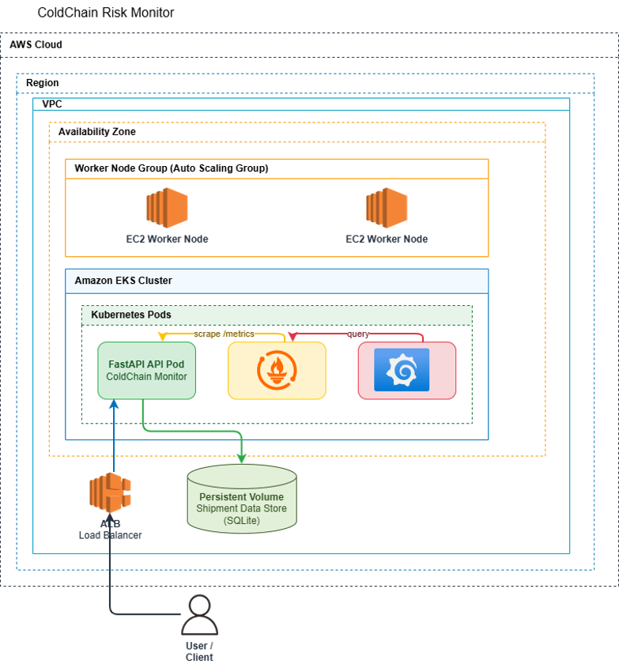
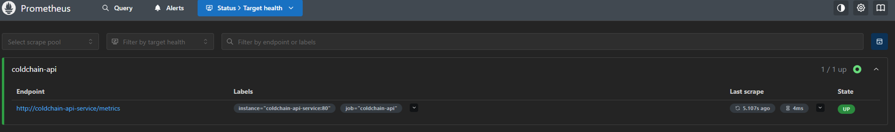
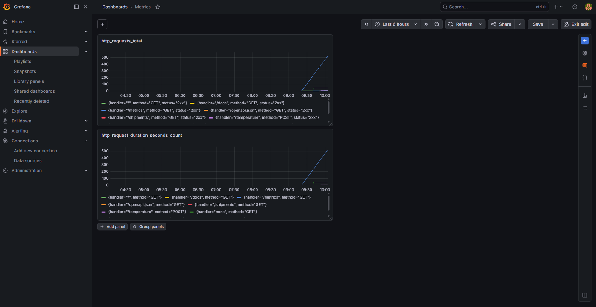
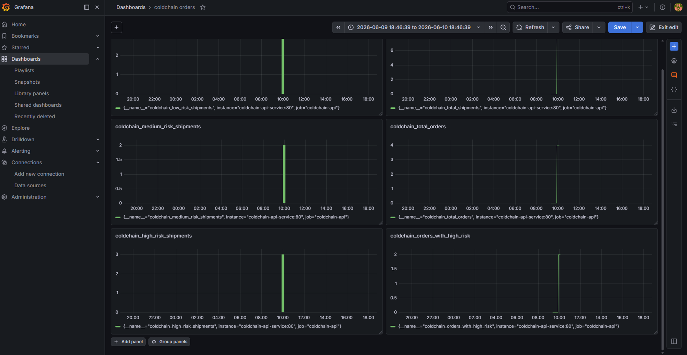
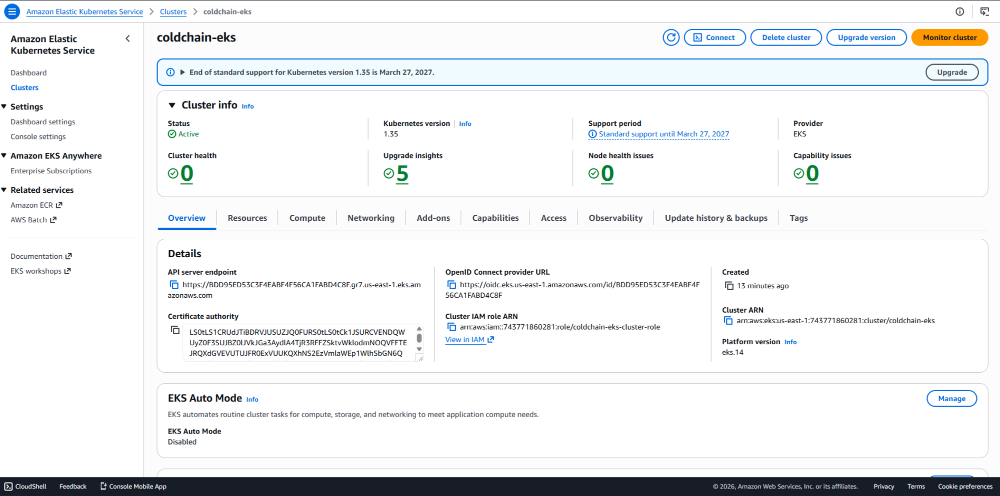
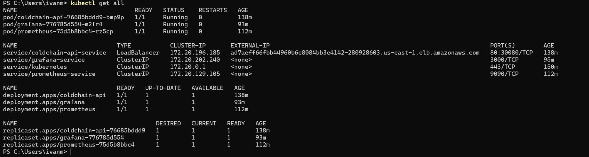
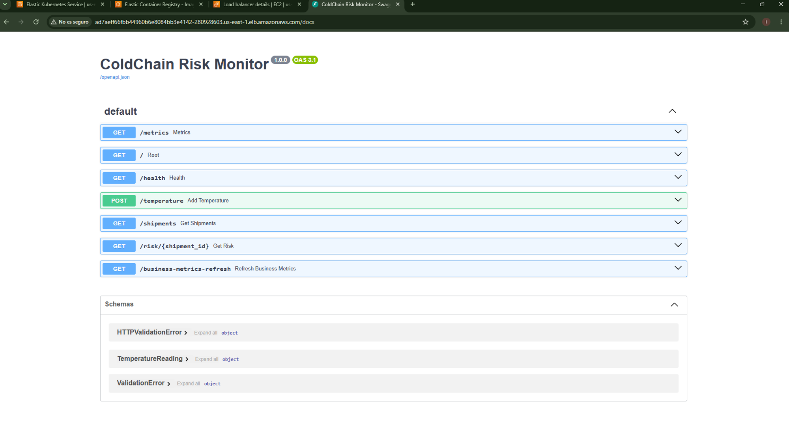

# ColdChain Risk Monitor
ColdChain Risk Monitor is a cloud-native application designed to monitor temperature-sensitive pharmaceutical shipments, such as vaccines, biological samples and medical products.

The project simulates cold-chain logistics operations by registering temperature readings, classifying shipment risk levels, and exposing both technical and business metrics through Prometheus and Grafana.

This project was developed as the final project of a Cloud Computing Bootcamp, with the goal of applying Docker, Kubernetes, Terraform, AWS and observability practices to a realistic Life Sciences use case.

## Business Problem
Cold-chain logistics is critical in the pharmaceutical and biotechnology industries. Products such as vaccines, biological samples or temperature-sensitive medicines must remain within controlled temperature ranges during transport.

A temperature deviation can compromise product quality, generate economic losses and potentially affect patient safety.

ColdChain Risk Monitor addresses this problem by providing a simple cloud-native system to:

- Register temperature readings from simulated shipments.
- Associate multiple shipments with the same order.
- Classify each shipment according to its temperature risk.
- Monitor operational and technical metrics in real time.
- Visualize business KPIs through Grafana dashboards.

## Risk Classification

The current implementation uses a simplified temperature-based risk model:

| Temperature | Risk Level |
|---|---|
| `≤ 8°C` | LOW |
| `> 8°C and ≤ 10°C` | MEDIUM |
| `> 10°C` | HIGH |

This logic is intentionally simple to keep the project focused on cloud infrastructure, containerization, Kubernetes deployment and observability.

In a production scenario, the risk model could be extended to consider product type, exposure time, historical temperature trends and regulatory requirements.

## Architecture
The application is deployed on AWS using Amazon EKS and exposes the FastAPI backend through an AWS Load Balancer.

Prometheus runs inside the Kubernetes cluster and scrapes the `/metrics` endpoint exposed by the application. Grafana is also deployed inside the cluster and connects to Prometheus as a data source to visualize business and technical metrics.

## Technologies Used
Category	            Technology
Programming Language	Python 3.12
Backend Framework	    FastAPI
Database	            SQLite
Containerization	    Docker
Container Registry	    Amazon ECR
Infrastructure as Code	Terraform
Container Orchestration	Kubernetes
Managed Kubernetes	    Amazon EKS
Monitoring	            Prometheus
Visualization	        Grafana
Cloud Provider	        AWS

## Application Features
The application exposes a REST API that allows users to register shipments and monitor cold-chain performance.

Available Endpoints
Endpoint	Method	Description
/	GET	Application information
/health	GET	Health check endpoint
/temperature	POST	Register a shipment temperature
/shipments	GET	Retrieve all registered shipments
/metrics	GET	Prometheus metrics endpoint
Example Request
{
  "order_id": "ORDER-001",
  "shipment_id": "SHIP-001",
  "product_type": "Vaccines",
  "temperature": 4.5
}
Example Response
{
  "risk": "LOW"
}

## Monitoring & Observability
Observability is a key component of modern cloud-native applications.

This project includes a complete monitoring stack based on Prometheus and Grafana deployed inside the Kubernetes cluster.

Prometheus

Prometheus continuously scrapes metrics exposed by the FastAPI application through the /metrics endpoint.

The monitoring configuration is deployed using Kubernetes manifests and runs as a dedicated pod inside Amazon EKS.

Prometheus collects both business and technical metrics.

Business Metrics

The following custom metrics were implemented:

Metric	Description
coldchain_total_orders	        Total number of registered orders
coldchain_total_shipments	    Total number of shipments
coldchain_low_risk_shipments	Number of low-risk shipments
coldchain_medium_risk_shipments	Number of medium-risk shipments
coldchain_high_risk_shipments	Number of high-risk shipments
coldchain_orders_with_high_risk	Orders containing at least one high-risk shipment

These metrics provide operational visibility into the cold-chain process.

Technical Metrics

The application also exposes technical metrics through Prometheus instrumentation, including:

Request count
Request rate

Grafana is deployed inside the Kubernetes cluster and connected to Prometheus as its data source.

Two dashboards were created:

Business Dashboard

The business dashboard provides operational KPIs such as:

Total Orders
Total Shipments
Low Risk Shipments
Medium Risk Shipments
High Risk Shipments
Orders with High Risk
Technical Dashboard

The technical dashboard provides application-level monitoring, including:

Request count
Request rate
API activity
Health monitoring
Monitoring Architecture
FastAPI Application
        |
        | /metrics
        v
Prometheus
        |
        v
Grafana

## Infrastructure as Code
The entire AWS infrastructure is provisioned using Terraform.

Using Infrastructure as Code (IaC) makes the environment reproducible, version-controlled and easy to deploy or destroy on demand.

The infrastructure was intentionally designed to be simple and cost-efficient while still demonstrating real-world cloud engineering concepts.

AWS Resources Provisioned

Terraform provisions the following AWS resources:

Networking:
Amazon VPC
Public Subnets
Private Subnets
Internet Gateway
Route Tables
Route Table Associations
Container Registry
Amazon Elastic Container Registry (ECR)

Used to store Docker images before deployment to Kubernetes.

Identity and Access Management:

IAM Roles and Policies were created for:

Amazon EKS Control Plane
Amazon EKS Worker Nodes

Kubernetes Platform:
Amazon EKS Cluster
Amazon EKS Managed Node Group

The cluster hosts:

FastAPI Application
Prometheus
Grafana
Infrastructure Diagram

Insert architecture diagram here:

Deployment Workflow
Developer
    |
    v
Docker Build
    |
    v
Amazon ECR
    |
    v
Amazon EKS
    |
    +--> FastAPI
    |
    +--> Prometheus
    |
    +--> Grafana

Terraform Modules

The Terraform configuration is organized into multiple files to improve readability and maintainability.

File	                Purpose
provider.tf	            AWS provider configuration
variables.tf	        Input variables
terraform.tfvars	    Environment values
vpc.tf	                VPC creation
subnets.tf	            Public and private subnets
internet-gateway.tf	    Internet Gateway
route-tables.tf	        Route Tables and associations
iam.tf	                IAM roles and policies
ecr.tf	                ECR repository
eks.tf	                EKS cluster and node group
outputs.tf	            Terraform outputs
Infrastructure          Lifecycle

Infrastructure can be created and destroyed on demand:

terraform init

terraform plan

terraform apply

terraform destroy

This approach minimizes AWS costs by ensuring resources only exist when actively being used.

## Local Deployment
Clone the Repository
git clone <repository-url>

cd coldchain-risk-monitor
Create Virtual Environment
python -m venv venv
Activate Virtual Environment

Windows:

venv\Scripts\activate

Linux / macOS:

source venv/bin/activate
Install Dependencies
pip install -r requirements.txt
Start the Application
uvicorn app.main:app --reload

The application will be available at:

http://localhost:8000

Swagger documentation:

http://localhost:8000/docs

## Docker Deployment
Build Docker Image
docker build -t coldchain-risk-monitor .
Run Container
docker run -p 8000:8000 coldchain-risk-monitor

Application:

http://localhost:8000

Swagger:

http://localhost:8000/docs

## AWS Deployment (EKS)
Provision Infrastructure

Navigate to the Terraform directory:

cd terraform

Initialize Terraform:

terraform init

Review the execution plan:

terraform plan

Deploy the infrastructure:

terraform apply

Configure kubectl

Connect kubectl to the EKS cluster:

aws eks update-kubeconfig \
  --region us-east-1 \
  --name coldchain-eks

Verify cluster access:

kubectl get nodes

Expected result:

STATUS = Ready
Push Docker Image to Amazon ECR

Authenticate Docker:

aws ecr get-login-password \
  --region us-east-1 \
| docker login \
  --username AWS \
  --password-stdin \
  <ecr-repository>

Tag the image:

docker tag coldchain-risk-monitor:latest \
<ecr-repository>:latest

Push image:

docker push <ecr-repository>:latest
Deploy Application

Deploy Kubernetes manifests:

kubectl apply -f k8s/

Verify pods:

kubectl get pods

Verify services:

kubectl get svc
Deploy Monitoring Stack

Deploy Prometheus and Grafana:

kubectl apply -f k8s/monitoring/

Verify monitoring pods:

kubectl get pods

Access Grafana:

kubectl port-forward service/grafana-service 3000:3000

Grafana:

http://localhost:3000

Access Prometheus:

kubectl port-forward service/prometheus-service 9090:9090

Prometheus:

http://localhost:9090
Destroy Infrastructure

To avoid unnecessary AWS costs:

terraform destroy

This removes all infrastructure resources created by Terraform.

## Cost Optimization
One of the main goals of this project was to demonstrate cloud-native technologies while keeping AWS costs under control.

Several design decisions were made to minimize infrastructure costs:

Cost Optimization Strategies
Single-node EKS cluster
Spot Instances for worker nodes
No NAT Gateway
Minimal infrastructure footprint
SQLite instead of a managed database
On-demand infrastructure provisioning with Terraform
Infrastructure destruction after testing
Why No NAT Gateway?

A NAT Gateway is commonly used to provide internet access to resources deployed in private subnets.

However, NAT Gateways generate continuous costs and were intentionally excluded from this project to reduce expenses during development and testing.

Infrastructure Lifecycle Management

Terraform was used to create and destroy the entire infrastructure on demand:

terraform apply
terraform destroy

This approach ensures that AWS resources only exist while actively being used.

## Future Improvements
Although the project fulfills its current objectives, several enhancements could be implemented in a production environment.

Application Improvements:
Replace SQLite with Amazon RDS PostgreSQL
Add user authentication and authorization
Implement shipment management UI
Support multiple cold-chain product categories
Advanced risk classification models

Infrastructure Improvements:
Multi-node EKS cluster
High availability deployment
Managed database service
Persistent Volumes for Grafana and Prometheus
Kubernetes Secrets for credential management
Infrastructure modularization using Terraform modules

DevOps Improvements:
CI/CD pipeline using GitHub Actions
Automated testing
Automated image deployment
Blue/Green deployments
Canary deployments

Monitoring Improvements:
Prometheus alerting rules
Grafana alerting
Email and Slack notifications
Distributed tracing
Centralized logging

## Screenshots

## Author
Iván Montes de Oca Estrada

PhD in Biological Chemistry with a growing specialization in Cloud Computing, AWS and Artificial Intelligence.

This project was developed as part of a Cloud Computing Bootcamp to gain hands-on experience with:

AWS
Terraform
Docker
Kubernetes
Prometheus
Grafana
Cloud-native application deployment

LinkedIn: [Iván Montes de Oca Estrada](https://www.linkedin.com/in/iv%C3%A1n-montes-de-oca-estrada-phd-456668299/)

GitHub: [ivanmoe27](https://github.com/ivanmoe27)